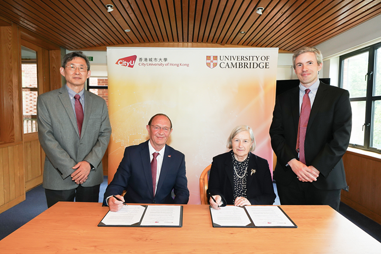
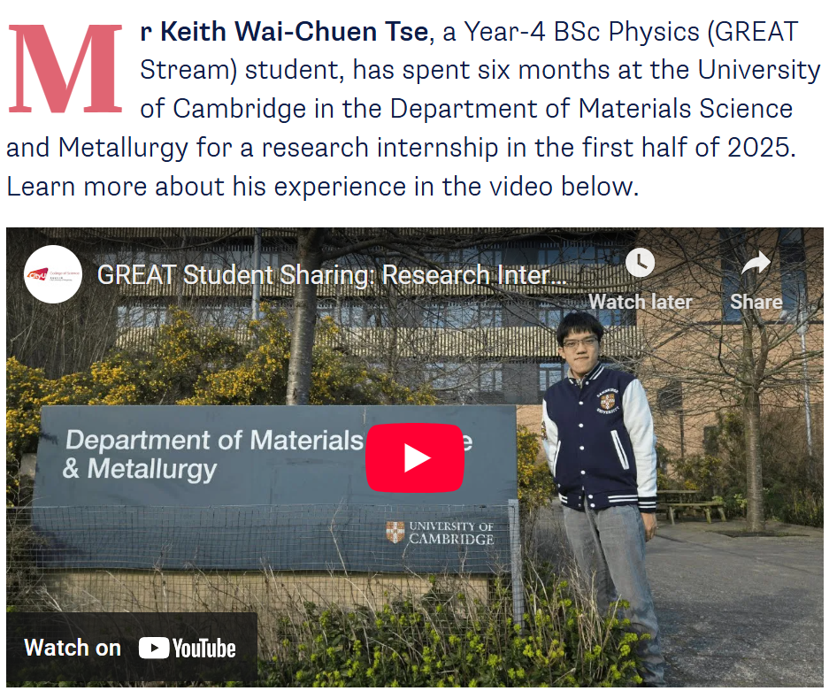

""

<!--more-->

Prof. Ren has initialized and established global academic and research collaborations between the Department of Physics (CityUHK) and the Department of Materials Science and Metallurgy (the University of Cambridge), and signed a Memorandum of Understanding (MoU) at Cambridge. This formal collaboration strengthens global research linkage and enables extended overseas research training for local students, contributing to high-level talent development for Hong Kong and fostering long-term international cooperation in materials physics.

