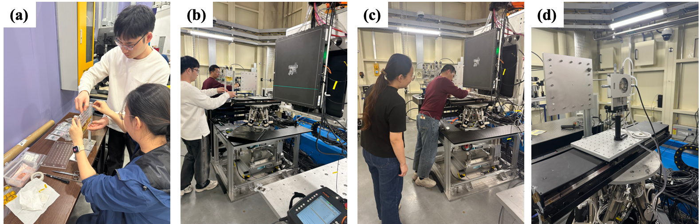

""

<!--more-->

To further advocate for Hong Kong research consortia at synchrotron facilities in Mainland China, Prof. REN's team led Ph.D. student Ms. Yangqian ZHANG to the High Energy Photon Source (HEPS) in Beijing to conduct in-situ high-energy X-ray Diffraction and Pair Distribution Function experiments. HEPS is China's flagship high-energy synchrotron radiation facility, with a 6 GeV storage ring and advanced beamlines. This experiment was carried out in collaboration with partners from the Institute of Metal Research, Chinese Academy of Sciences, and the Guangdong Academy of Sciences. A key technical achievement was the development and implementation of an in-situ heating setup enabling measurements from room temperature to 400 °C. The Lab is also preparing to establish an 'Advanced Materials Characterization Joint Laboratory' between HEPS and the JC STEM Lab.

