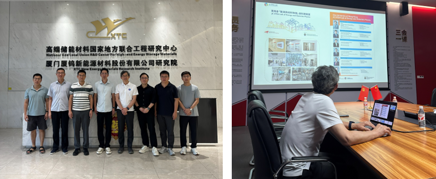

""

<!--more-->

Prof. Yang REN visited XTC New Energy Materials Research Institute for an in-depth technical exchange on 27 June 2026. The discussion primarily focused on the practical challenges and optimization strategies for advanced cathode materials in commercial applications. Aligning with the enterprise's core manufacturing concerns, the dialogue centered on essential crystal characteristics, including particle morphology, grain boundary stability, and the underlying mechanisms of structural degradation. Prof. REN and the company's R&D engineers systematically analyzed how internal stress and anisotropic volume changes induce micro-cracking and grain boundary fracture during prolonged charge-discharge cycles, establishing a foundation for future joint efforts.

