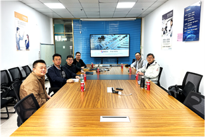

""

<!--more-->

To actively drive the integration of industry, academia, and research, the collaborative team conducted an in-depth technical exchange at Dongguan Yihao Metal Technology Co., Ltd. Anchored by the funded Guangdong-Hong Kong Universities '1+1+1' Joint Funding Scheme (supported by RMB 2 million and HKD 1 million), the discussions focused on accelerating the industrial application and commercialization of advanced metallic glass components. This synergistic engagement effectively bridged fundamental academic research with practical manufacturing capabilities, laying a robust foundation for transforming innovative materials technologies into competitive industrial products.

