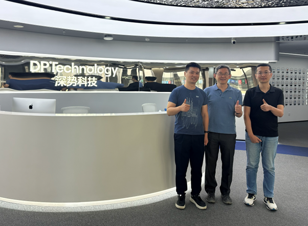

""

<!--more-->

To explore the transformative potential of 'AI for Science' in materials research, Prof. Yang REN initiated a strategic technical exchange with DP Technology, a pioneering enterprise in artificial intelligence and scientific computing. The discussion focused on bridging the JC STEM Lab's multi-modal characterization capabilities with machine learning algorithms to overcome data processing bottlenecks. Prof. REN and the company's experts explored innovative frameworks for efficiently analyzing the massive, multidimensional datasets generated during high-throughput operando synchrotron and neutron scattering experiments. By integrating DP Technology's deep learning models with the Lab's rich experimental data, the teams evaluated automated workflows for rapidly parsing dynamic structural evolution.

