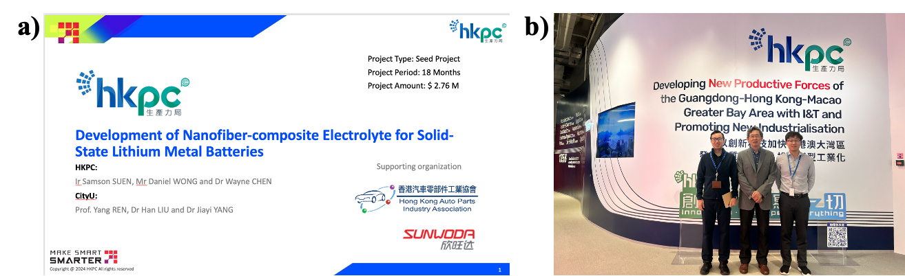

""

<!--more-->

The lab actively advocates for the creation of a local industry consortium to support synchrotron-based advanced research initiatives. Lab members attended a workshop at the Nano and Advanced Materials Institute Limited (NAMI) to discuss and plan collaborative projects between CityUHK and NAMI. The discussions focused on the advanced manufacturing and scalable production of solid-state lithium-ion batteries, aiming to leverage innovative materials and processes to address challenges in efficiency, reliability, and commercial viability.

