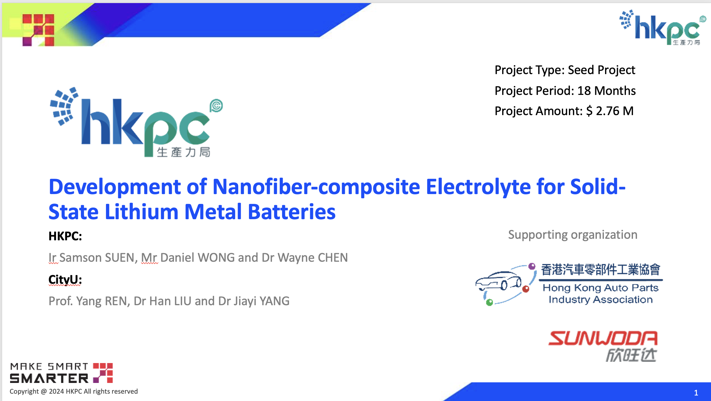

""

<!--more-->

Prof. Ren led his research group in collaboration with the Hong Kong Productivity Council (HKPC) to apply for the Innovation and Technology Support Programme (Seed) in June 2024. This industry collaboration project was submitted and was under review at the time of the report. The partnership with HKPC, a statutory body promoting productivity in Hong Kong, exemplifies Prof. Ren's effort to bridge synchrotron-based research with industry applications and to translate fundamental materials science discoveries into practical outcomes that benefit Hong Kong's industrial sector.

