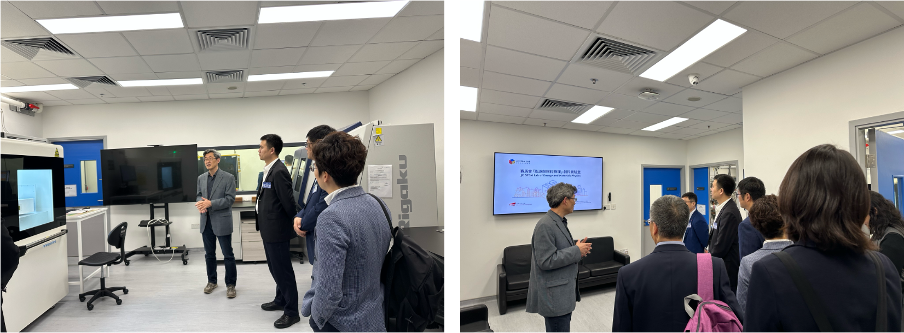

""

<!--more-->

Prof. REN's team further strengthened domestic collaboration through a joint proposal with Prof. Zhenbo WANG from Harbin Institute of Technology under the National Natural Science Foundation of China (NSFC) / Research Grants Council (RGC) Joint Research Scheme 2026/27. The proposed project, 'Visualization of Cross-Scale Structural and Chemical Heterogeneity of Lithium-Rich Cathodes and the Coupling Mechanism of Performance Degradation' (N_CityU1114/26), focuses on understanding the structural and chemical heterogeneity of lithium-rich cathode materials. This collaboration is built upon Prof. REN's long-standing expertise in synchrotron X-ray and neutron scattering techniques. By using advanced large-scale facilities, the project aims to reveal the evolution of cathode materials across different length scales and clarify the relationship between structural heterogeneity and battery performance degradation.

