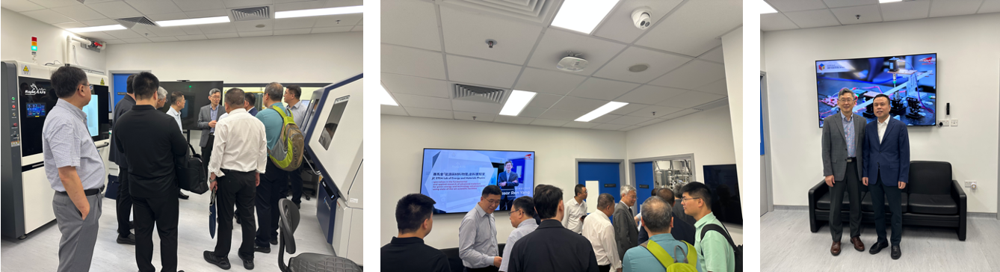

""

<!--more-->

Following the visit of engineers from Amperex Technology Limited (ATL) to the JC STEM Lab of Energy and Materials Physics in the previous reporting period, government officials and experts from Ningde City, where major battery companies such as ATL and CATL have important operations, also visited the Lab for further exchange. During the visit, Prof. REN introduced the Lab's research platform and explained how its advanced characterization capabilities, including synchrotron- and neutron-related techniques, can be combined with industrial needs to address technical challenges in battery materials and devices. Both sides exchanged views on key issues in the battery field, including materials design, structural characterization, performance evaluation, and technology translation.

