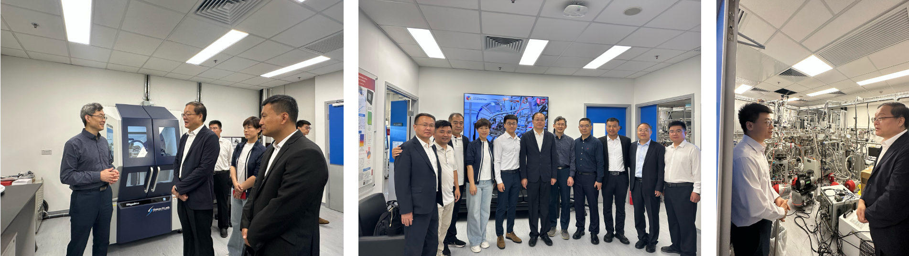

""

<!--more-->

The Mayor of Linyi City, together with government representatives and experts, visited the JC STEM Lab of Energy and Materials Physics for further discussion and academic exchange. During the visit, Prof. REN introduced the Lab's research platform and highlighted how its advanced characterization capabilities, including synchrotron- and neutron-related techniques, can support materials research, technology validation, and industrial problem-solving. Both sides discussed how to better combine Hong Kong's international research platform and academic strengths with Shandong's industrial foundation and manufacturing advantages. In particular, Linyi Lingang Economic Development Zone provides a strong base for advanced manufacturing, materials processing, and industrial scale-up.

