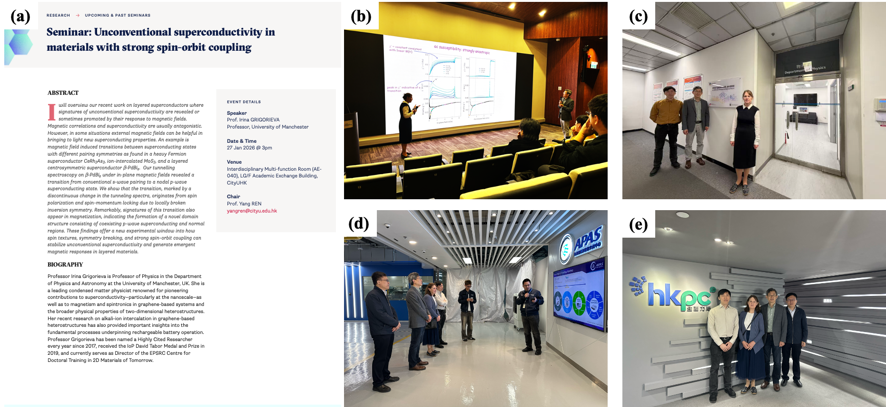

""

<!--more-->

Following the seminar, Prof. GRIGORIEVA visited the JC STEM Lab of Energy and Materials Physics and discussed potential collaboration with Prof. REN's team. By combining Manchester's strength in graphene and two-dimensional materials with the Lab's capabilities in X-ray Absorption Fine Structure spectroscopy, X-ray Diffraction, Angle-resolved Photoemission Spectroscopy, and synchrotron/neutron large-scale facility characterization, both sides may explore future studies on electronic structures, interfacial coupling, phase transitions, and structure–property relationships in quantum materials. Prof. GRIGORIEVA's research covers superconductivity, graphene-related materials, van der Waals heterostructures, spintronic materials, and atomically thin membranes, providing strong relevance to the JC STEM Lab's future development in quantum and functional materials.

