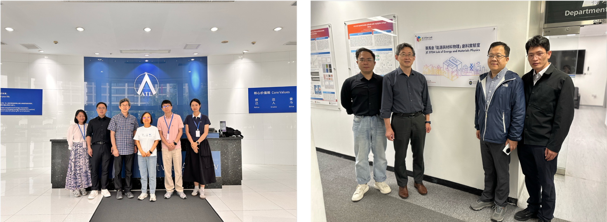

""

<!--more-->

Building on the engagement with ATL, senior management representatives from Amperex Technology Limited visited City University of Hong Kong for reciprocal discussions. These meetings explored opportunities for deepening collaboration on industry-oriented R&D projects, with particular emphasis on accelerating the industrialization and practical deployment of advanced battery technologies. This two-way exchange established a solid foundation for sustained joint efforts that bridge fundamental research, engineering development, and large-scale industrial implementation.

