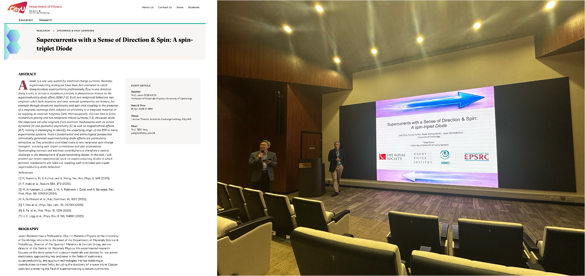

""

<!--more-->

Building upon an established Memorandum of Understanding between CityUHK and the University of Cambridge, Prof. Yang REN hosted Prof. Jason ROBINSON, Professor of Materials Physics at the University of Cambridge, for a seminar titled 'Supercurrents with a Sense of Direction & Spin: A Spin-Triplet Diode' held on 15 April 2026 at City University of Hong Kong. Prof. ROBINSON introduced the frontier topic in superconducting spintronics, encompassing spin-triplet supercurrents, non-reciprocal transport and quantum materials for low-power electronic devices. This academic exchange significantly strengthened international research ties, paving the way for joint studies combining Cambridge's spintronics expertise with the JC STEM Lab's advanced characterization capabilities to explore interface-driven electronic states and magnetic heterostructures.

