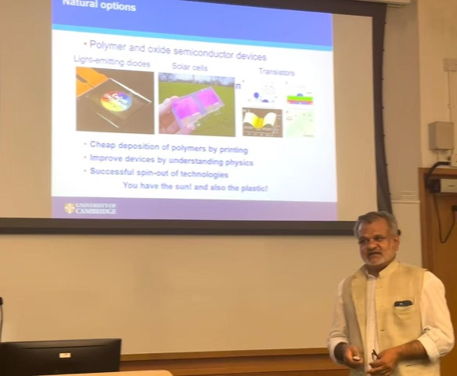

""

<!--more-->

To strengthen international academic collaboration and explore emerging frontiers in quantum science and sustainability, Prof. Ren hosted Prof. Siddharth Shanker Saxena, Professor at the University of Cambridge, for a seminar titled "Novel Quantum Technologies and Green Transition Strategies" on 12 August 2025 at City University of Hong Kong. Prof. Saxena presented cutting-edge research on quantum materials and their transformative potential for next-generation technologies, while outlining key strategies to facilitate the global transition toward green and sustainable energy systems. The seminar inspired vibrant discussions among faculty and students, opening new avenues for collaborative research at the interface of quantum technology and sustainable development.

