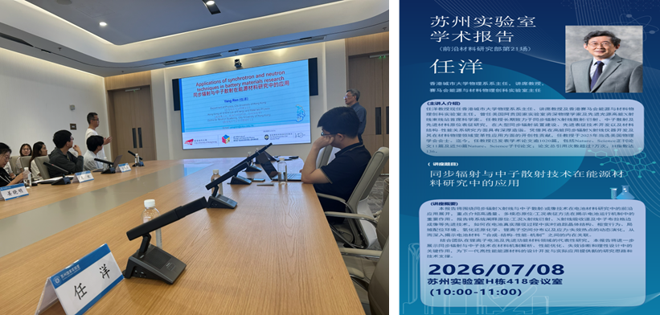

""

<!--more-->

Continuing to expand the JC STEM Lab's strategic domestic partnerships, Prof. Yang REN visited Suzhou Laboratory on 8 July 2026 to deliver an invited academic report for their Frontier Materials Research Department. The seminar titled 'Applications of Synchrotron and Neutron Techniques in Energy Materials Research' showcased recent advancements in high-throughput, multimodal operando characterization methods. Prof. REN elaborated on how integrating advanced techniques (such as in-situ X-ray diffraction, absorption spectroscopy, and neutron Bragg-edge imaging) can dynamically track crystal structure evolution, local coordination and strain-induced failure in battery materials under authentic operating conditions.

