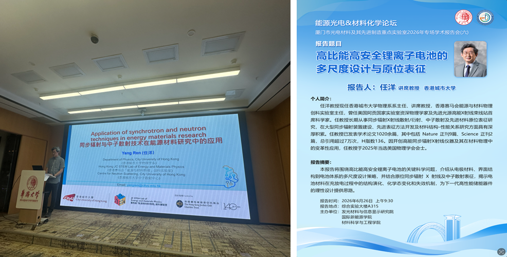

""

<!--more-->

In a continued effort to foster academic partnerships and advance energy storage solutions, Prof. Yang REN delivered a featured presentation at Huaqiao University on 26 June 2026, titled 'Applications of Synchrotron and Neutron Techniques in Energy Materials Research.' His lecture focused on the critical scientific bottlenecks in developing reliable and high-energy-density power systems. Prof. REN outlined comprehensive multiscale design strategies spanning from atomic-level electrode materials and complex interfacial architectures to macroscopic battery systems. By highlighting the integration of in-situ synchrotron X-ray and neutron scattering techniques, he demonstrated precise methods to monitor structural evolutions, chemical state transitions, and underlying failure mechanisms during real-time charge-discharge cycles.

