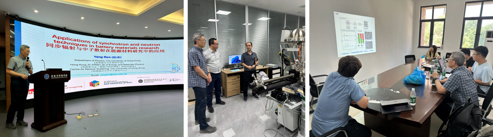

""

<!--more-->

To further expand domestic academic networks and engage with premier institutions in materials engineering, Prof. Yang REN delivered an invited seminar at Central South University titled 'Applications of Synchrotron Radiation and Neutron Techniques in Energy Materials Research.' The lecture focused on the structural stability of advanced cathode materials. Prof. Ren provided an in-depth analysis of how in-situ synchrotron and neutron techniques uniquely track complex phenomena, such as transition metal migration and the mechanism of lattice oxygen stabilization via strong metal-oxygen covalent bonding during electrochemical cycling. Following the lecture, Professor Ren toured the laboratories at the School of Metallurgy and Environment and engaged in extensive academic discussions with faculty and students.

