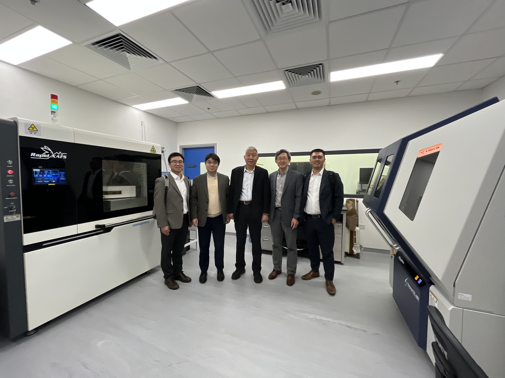

""

<!--more-->

During the reporting period, the Lab hosted a visiting Ph.D. student, Mr. Bin CAO, from The Hong Kong University of Science and Technology (Guangzhou) from July to December 2025. Mr. CAO's research focused on machine learning and AI-driven integration with synchrotron radiation and neutron scattering techniques, contributing to the strategic direction in data-enabled materials physics. The visit laid a solid foundation for sustained collaboration and for future training of local students in the emerging intersection of artificial intelligence and large scientific facilities.

