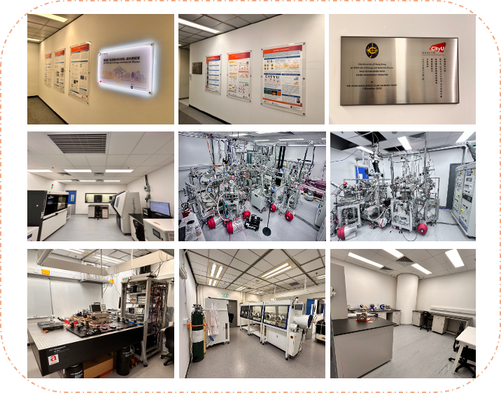
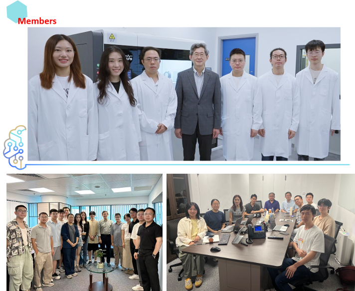

""

<!--more-->

Prof. Ren received HKD 9.35 million from the Hong Kong Jockey Club to establish the JC STEM Lab of Energy and Materials Physics, which has now been fully renovated and is in normal operation. The laboratory provides an advanced R&D platform that bridges fundamental science, cutting-edge technology, and practical production. Key facilities include "Quantum Beast" – QuARPES, X-ray Absorption Fine Structure (XAFS) system, high-resolution X-ray diffraction (XRD) instruments, comprehensive battery testing systems, and a pouch-cell pilot production line. The Lab serves as a vibrant training platform for young researchers, currently comprising 11 post-graduate students (including 3 Hong Kong permanent residents), 10 postdoctoral fellows, 5 visiting scholars, and 4 undergraduates. The Lab was officially opened at a ceremony jointly organized by the Jockey Club and City University of Hong Kong on 3 July 2025.

