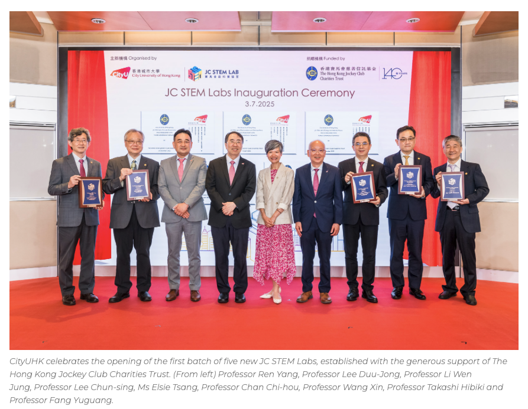
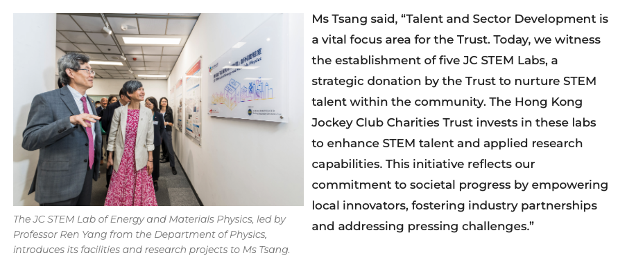
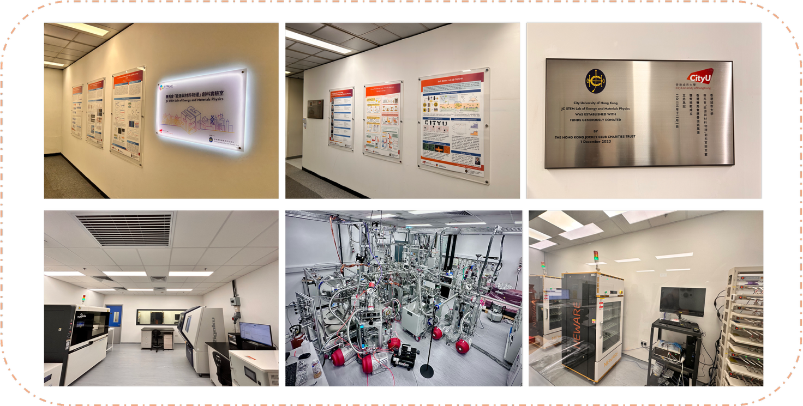

""

<!--more-->

The JC STEM Lab of Energy and Materials Physics, led by Professor Yang Ren, was officially launched during the inaugural ceremony for the first group of JC STEM Labs supported by The Hong Kong Jockey Club Charities Trust on the 3rd July 2025. The event brought together senior university leaders and partners to celebrate the Lab's establishment and to highlight its mission in advancing interdisciplinary research and nurturing local STEM talent. The successful start-up of the Lab marks a key milestone toward strengthening Hong Kong's research capacity in energy and materials physics and promoting sustained collaboration between academic, industry, and the broader scientific community.

