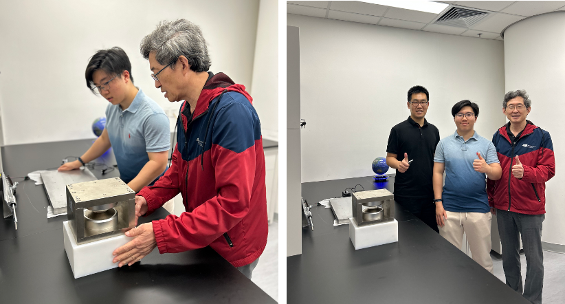

""

<!--more-->

Prof. Ren contributes to science education and talent development at the pre-university level. He recently supervised a high-school student in a research project on magnetocaloric effects, solid-state cooling, and phase transitions. Through guided experiments, literature analysis, and discussions, the student gained a deeper understanding of the interplay between physics and materials science. This early research experience not only strengthened the student's fundamental knowledge but also fostered scientific curiosity and critical thinking, laying a solid foundation for future studies in physical sciences and advanced materials.

