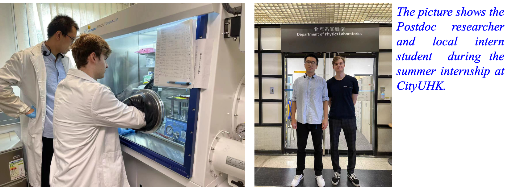

""

<!--more-->

Prof. Ren hosted a local intern student at his research group, providing hands-on experience in advanced research methodologies. The student actively contributed to ongoing projects under close mentorship, gaining exposure to experimental design, data analysis, and the use of specialized equipment together with the postdoc researcher. Through this training, the intern developed a deeper understanding of the research process and demonstrated significant progress in both technical skills and critical thinking, supporting the development of local research talent in synchrotron X-ray and materials science research.

