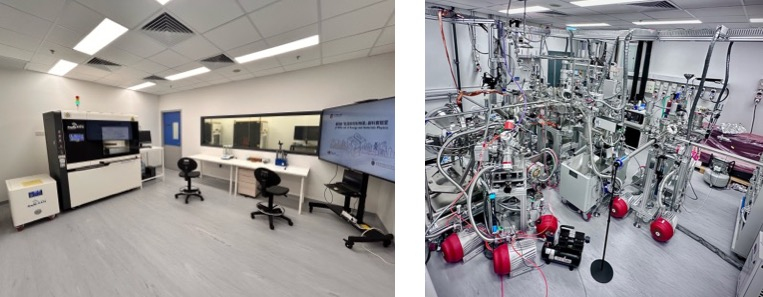

""

<!--more-->

The renovated laboratory features a comprehensive suite of advanced research tools, including Hong Kong's first benchtop X-ray Absorption Fine Structure (XAFS) system and a state-of-the-art integrated system of Laser Molecular Beam Epitaxy (LMBE) and Angle-resolved photoemission spectroscopy (ARPES) facility. These instruments enable synchrotron-level analysis of atomic structure and electronic properties, supporting frontier research in energy storage, catalysis, and quantum materials. In addition, a high-throughput battery testing platform with over 400 independent channels has been installed for simultaneous electrochemical measurements of coin cells, significantly accelerating battery material screening and performance evaluation. Together, these facilities not only enhance research capabilities but also provide hands-on training opportunities for students.

