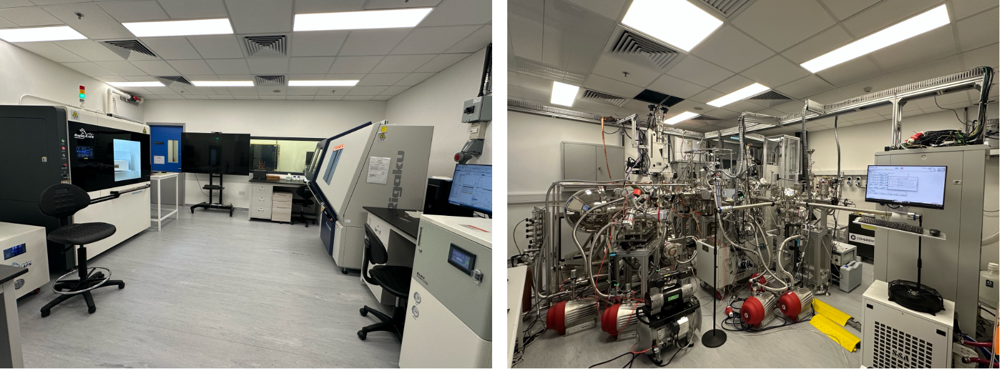

""

<!--more-->

The Lab expanded its research platform by completing the setup of a pouch-cell pilot line, the first pouch-cell pilot line established in a Hong Kong university. The new platform enables the Lab to scale up battery materials research from coin-cell evaluation to larger-format pouch cells, bringing fundamental studies closer to practical application and industrial relevance. It also strengthens the connection between advanced characterization, materials design, and device-level validation. In addition, the pouch-cell pilot line provides an important training platform for local STEM talents. Local students, including high-school and undergraduate students, will be able to gain first-hand exposure to practical battery manufacturing processes and better understand how laboratory research can be translated into real energy-storage technologies.

