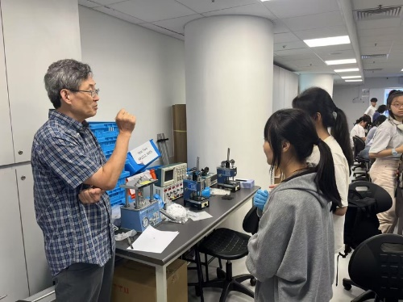

""

<!--more-->

To strengthen the STEM talent pipeline at an earlier stage, the laboratory engages with local high school students through internships and outreach activities. During the past semesters, a local high-school student was supervised on projects related to magnetocaloric effects, solid-state cooling and energy materials. In addition, as part of the Physics Department's summer camp, the laboratory hosted experimental demonstrations and battery assembly sessions, involving approximately 40 local high school students. Prof. REN delivered theoretical instruction to these students as part of STEM outreach activities.

