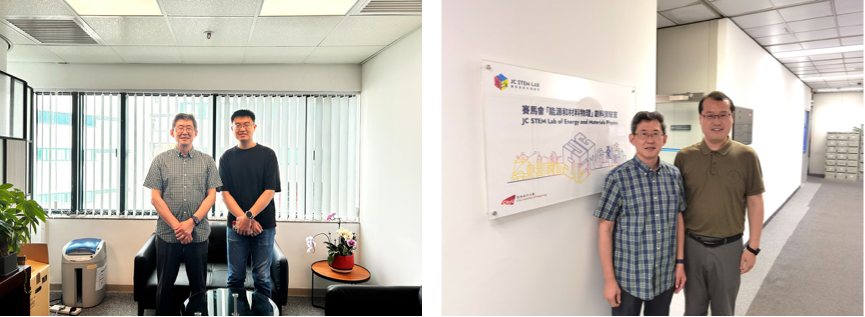

---
title: "Visiting Scholar Training: Prof. Chen Cunguang on Dispersion-Strengthened Metals"
date: "2025-01-01"
tags: ["training"]
---

<!--more-->

Prof. Chen Cunguang, an associate professor specializing in metal materials, visited the JC STEM Lab to explore the structural design and toughening mechanisms of dispersion-strengthened metals. His collaboration integrated the lab's expertise in multi-scale structural characterization with his ongoing projects on aluminum and copper matrix nanocomposites. Through close exchange with the JC STEM Lab team, Prof. Chen enhanced his familiarity with state-of-the-art tools, broadened his academic vision, and established new research directions with practical industrial potential. Prof. Chen noted that the strong academic atmosphere and advanced facilities at the lab were impressive, and he expressed willingness to recommend outstanding students and scholars for future exchanges and collaborations.

