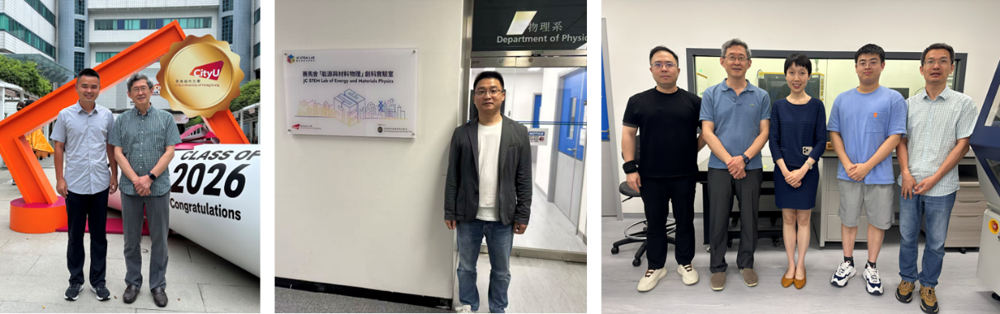

<!--more-->

Dr. Yulong YANG from Jingdezhen Ceramic University joined the group from January 2026 to December 2026 to conduct research on the controlled construction of catalytic ceramic membranes for the efficient removal of emerging contaminants. Integrating advanced synchrotron and neutron scattering techniques with in-situ spectroscopy, Dr. Yang systematically evaluated microstructural features and active-site chemistry. This year-long project aims to elucidate catalytic pathways and enhance membrane durability for next-generation water purification.

