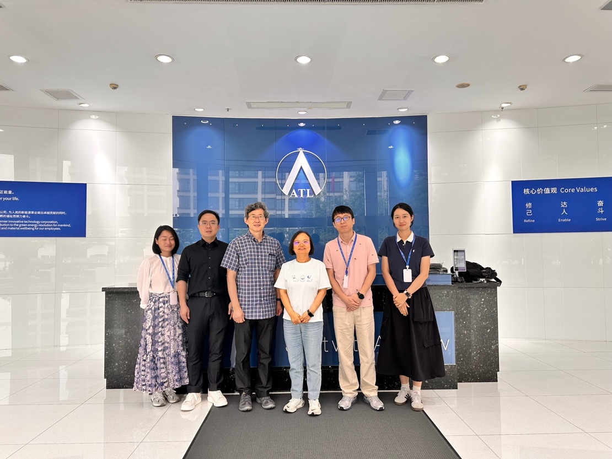

<!--more-->

To strengthen industry–academia collaboration and explore opportunities in emerging markets, Prof. Ren visited Amperex Technology Limited (ATL) in Dongguan, Guangdong, for a field study and technical discussion. The visit focused on how next-generation lithium-ion battery technologies can support the rapidly expanding low-altitude economy, including electric aerial vehicles and related applications. During the meeting, Prof. Ren and ATL experts exchanged insights on high-energy-density cell design, safety optimization, and pilot-scale manufacturing, laying the groundwork for future joint projects that integrate advanced research with large-scale industrial deployment.

