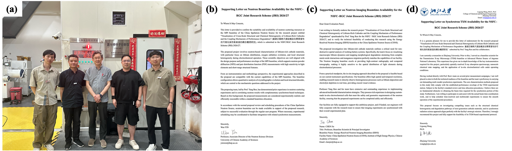

<!--more-->

To further advocate for Hong Kong research consortia at major scientific facilities in Mainland China, Prof. REN led Ph.D. students and postdoctoral researchers from the team to the China Spallation Neutron Source (CSNS) to conduct neutron diffraction, neutron Pair Distribution Function, and neutron Bragg-edge imaging experiments. CSNS provides a major national neutron scattering platform, with instruments covering powder diffraction, engineering materials diffraction, energy-resolved neutron imaging, and multi-physics characterization. This experiment was jointly carried out with CSNS, Prof. Liguang WANG from Zhejiang University, and Amperex Technology Limited (ATL) in Ningde. The research focused on cathode and anode materials for advanced batteries, aiming to reveal their crystallographic structure, local atomic arrangement, strain distribution, and structure–property relationships.

