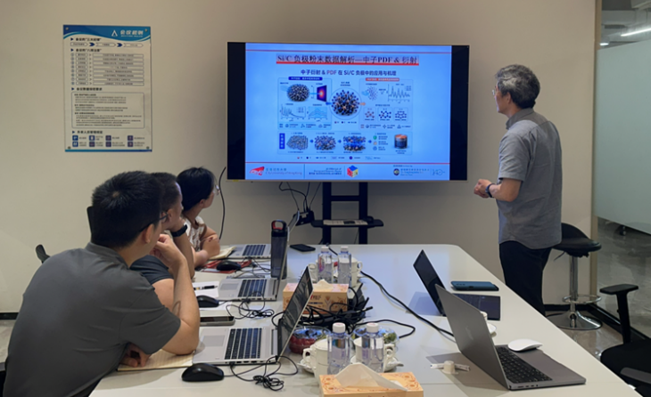

<!--more-->

Further expanding the Lab's footprint in industrial collaboration, Prof. Yang REN held a focused technical exchange with Amperex Technology Limited (ATL), a premier global manufacturer of lithium-ion batteries. The dialogue targeted the critical engineering and structural challenges of next-generation silicon-carbon (Si-C) composite anodes. The core of the discussion centered on the practical application and complex data interpretation of neutron diffraction and Pair Distribution Function (PDF) technologies in evaluating these advanced composite materials. Prof. REN detailed how neutron diffraction provides unparalleled sensitivity to the dynamic distribution of light elements like lithium, while total scattering PDF analysis is uniquely suited for resolving the local atomic arrangements, short-range order, and amorphous domains.

