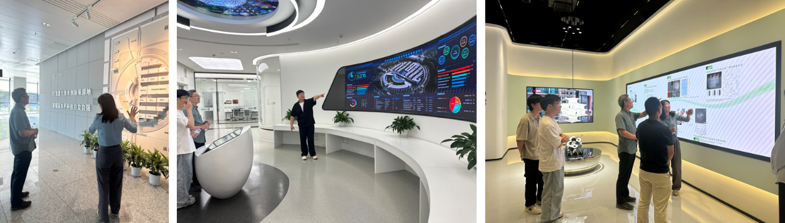

<!--more-->

To further expand strategic domestic networks in the field of advanced materials, Prof. Yang REN engaged in a targeted academic and technical exchange with Liaoning Academy of Materials. The exchange centered on the application of advanced characterization techniques for high-performance metals and complex alloy systems. Prof. REN highlighted the unique advantages of high-energy synchrotron X-ray diffraction, specifically its deep-penetration capabilities for the non-destructive, three-dimensional analysis of bulk materials. He provided an in-depth analysis of methods for observing internal residual stresses and solid-state phase transformations under conditions of extreme thermo-mechanical coupling and fatigue loading.

