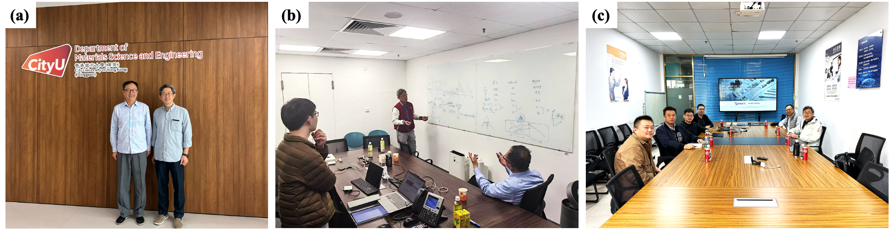

<!--more-->

The Lab strengthened its collaboration with Prof. Yi LI from the Department of Materials Science and Engineering at City University of Hong Kong (Dongguan) in the field of metallic glasses. Through mutual visits and in-depth discussions, the collaboration has developed from academic exchange into a joint research programme supported by advanced synchrotron and neutron scattering techniques. Prof. REN's team contributed its expertise in large-scale facility characterization, particularly high-energy synchrotron X-ray scattering, neutron scattering, and total scattering analysis, to investigate the atomic-scale structure, energy-state evolution, and structure–property relationships of metallic glasses. These capabilities provided a strong technical foundation for the collaboration and enabled the two teams to connect materials design, structural characterization, and performance evaluation.

