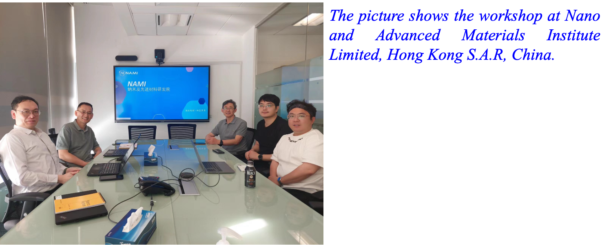

<!--more-->

The lab led a research group in collaboration with the Hong Kong Productivity Council (HKPC) to apply for the Innovation and Technology Support Programme (Seed) in June 2024, focusing on the 'Development of Nanofiber-Composite Electrolyte for Solid-State Lithium Metal Batteries.' As part of the application process, the team conducted an on-site visit to HKPC, engaging in in-depth discussions on advancing technologies related to solid-state lithium-ion batteries. These exchanges explored potential synergies and collaborative opportunities to drive innovation and development in this cutting-edge field.

