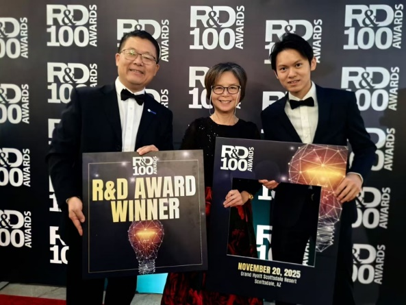

<!--more-->

The Lab continued its collaborative effort with the Nano and Advanced Materials Institute (NAMI), focusing on advanced manufacturing and scalable development of solid-state lithium-ion batteries. Under this partnership, NAMI sponsors Mr. WANG Pao Chieh, a local CityUHK graduate, as a part-time Ph.D. student under the supervision of Prof. Yang Ren. As a researcher within NAMI, Mr. WANG has been recognized with an R&D 100 Award, highlighting the success of his dual academic–industry role that strengthens talent development while facilitating effective knowledge transfer toward industrial application.

