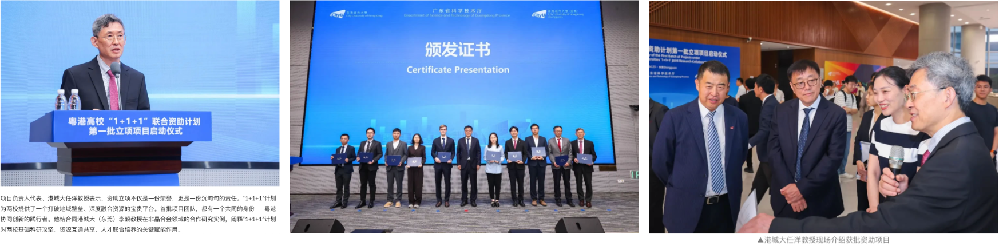

<!--more-->

To further promote industry–academia–research integration, the teams also visited Dongguan Yihao Metal Technology Co., Ltd. and discussed deeper collaboration on the industrial application of metallic glass components. This industry visit helped connect fundamental academic research with industrial manufacturing, bridging materials science and engineering applications in metallic glasses. The visit laid the foundation for joint industrial application development and technology translation in the Greater Bay Area.

