

<!--more-->

The Hong Kong Forum on Neutron Scattering is a conference series that focuses on specific aspects of neutron scattering science and their applications. The **2026 Forum** will feature **soft matter and complex materials**, particularly in relation to scientific research and instrument development.

Sponsored by the **Croucher Foundation** and the **Center for Neutron Scattering at City University of Hong Kong (CityUHK)**, the 2026 Forum will gather leading experts from around the world in the fields of soft matter and biophysics, as well as specialists from major international neutron scattering facilities, to share their latest findings and discuss current issues.

Additionally, the forum will provide opportunities for students and early-career scientists in Hong Kong and the surrounding area to learn the fundamentals and applications of neutron scattering.

## Forum Details

- **Dates:** 7–11 December 2026 (scientific sessions 8–10 December)
- **Time:** 9:00 AM – 6:00 PM daily
- **Venue:** Benjamin & Anny Kwok Multi-media Conference Room, City University of Hong Kong, Tat Chee Avenue, Kowloon, Hong Kong
- **Format:** In-person conference
- **Language:** English
- **Focus:** Soft Matter & Complex Materials

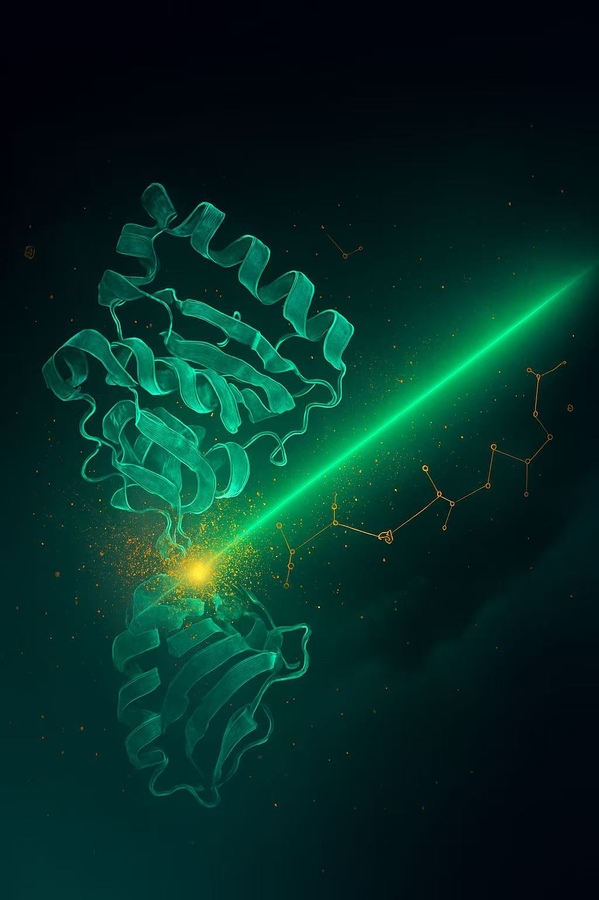

## Focus Areas

- **Soft Matter** — polymers, colloids, liquid crystals
- **Complex Materials** — multifunctional and hybrid materials
- **Biophysics** — biological applications of neutron scattering
- **Instrument Development** — new neutron scattering techniques
- **Data Analysis** — advanced computational methods
- **Industrial Applications** — practical implementations in industry

## Invited Speakers

**Prof. Frank Gabel** — *Institut Laue-Langevin (ILL), France*

[Profile](https://www.ill.eu/for-ill-users/scientific-groups/biology-deuteration-chemistry-and-soft-matter-support/people/frank-gabel)

**Dr. Peter Falus** — *Institut Laue-Langevin (ILL), France*

 [Profile](https://www.ill.eu/for-ill-users/scientific-groups/spectroscopy/people/peter-falus)

**Prof. Jian Ren Lu** — *The University of Manchester, United Kingdom*

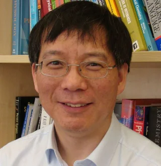 [Profile](https://research.manchester.ac.uk/en/persons/j.lu)

**Dr. Mona Sarter** — *ISIS Neutron and Muon Source, United Kingdom*

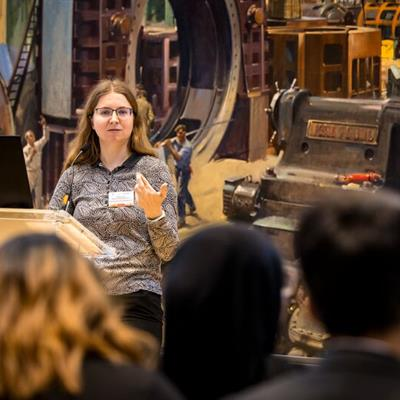 [Profile](https://www.isis.stfc.ac.uk/Pages/SH25_Mona-Sarter.aspx)

**Dr. Peixun Li** — *ISIS Neutron and Muon Source, United Kingdom*

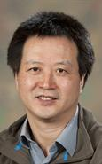 [Profile](https://www.isis.stfc.ac.uk/Pages/Dr-Peixun-Li.aspx)

**Prof. Sung-Min Choi** — *Korea Advanced Institute of Science and Technology (KAIST), Korea*

[Profile](https://pure.kaist.ac.kr/en/persons/sung-min-choi)

**Prof. Hideki Seto** — *J-PARC / CROSS, Japan*

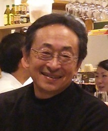 [Profile](https://research.kek.jp/people/seto/profile.html)

**Prof. Koichi Mayumi** — *University of Tokyo, Japan*

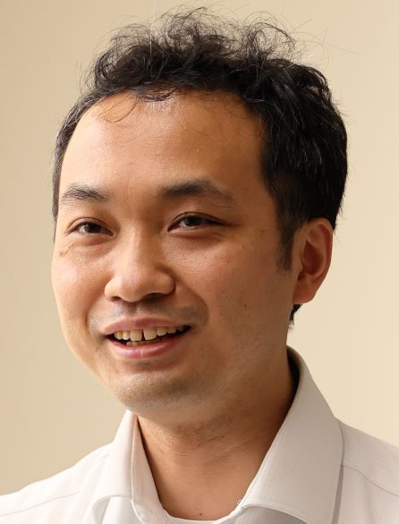 [Profile](https://www.k.u-tokyo.ac.jp/materials/en/mayumi/)

**Prof. Tatsuro Oda** — *University of Tokyo, Japan*

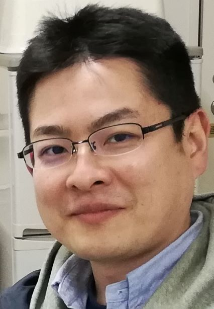 [Profile](https://www.u-tokyo.ac.jp/focus/en/people/k0001_04078.html)

**Prof. Takeshi Yamada** — *J-PARC / CROSS, Japan*

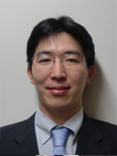 [Profile](https://www.scl.kyoto-u.ac.jp/~kanaya2/yamada.html)

**Prof. Limei Xu** — *Peking University, China*

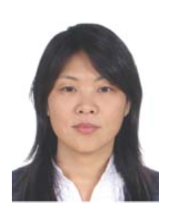 [Profile](https://faculty.pku.edu.cn/~niQ7Vj/en/index.htm)

**Dr. Hongyu Guo** — *China Spallation Neutron Source (CSNS), China*

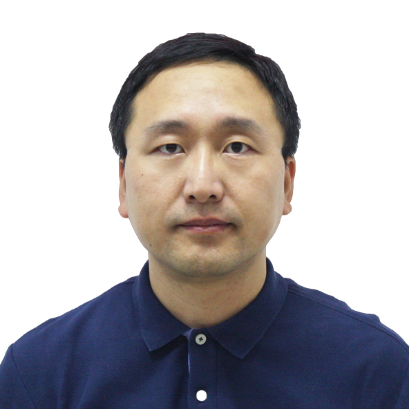 [Profile](https://people.ucas.ac.cn/~GUO?language=en)

**Prof. He Cheng** — *China Spallation Neutron Source (CSNS), China*

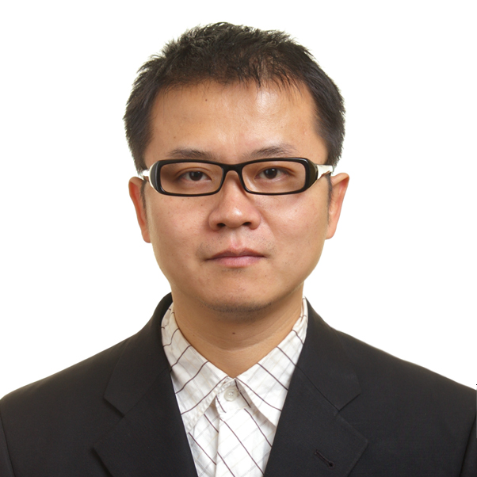 [Profile](https://people.ucas.edu.cn/~chenghe?language=en)

**Prof. Yubin Ke** — *China Spallation Neutron Source (CSNS), China*

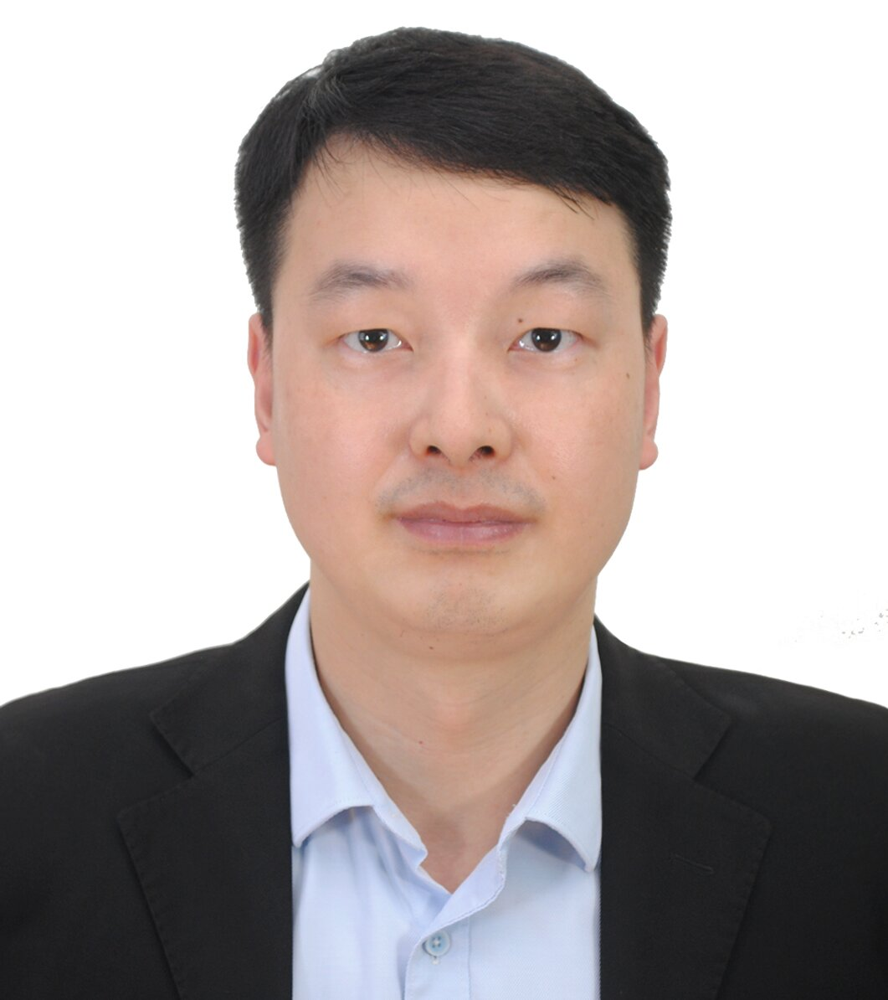 [Profile](https://people.ucas.ac.cn/~yubinke)

**Prof. George Sawatzky** — *The University of British Columbia, Canada*

[Profile](https://phas.ubc.ca/users/george-sawatzky)

**Dr. Taisen Zuo** — *China Spallation Neutron Source (CSNS), China*

[Profile](https://people.ucas.edu.cn/~zuotaisen.ucas.edu.cn)

**Dr. Hanqiu Jiang** — *China Spallation Neutron Source (CSNS), China*

[Profile](https://people.ucas.ac.cn/~jianghanqiu)

**Prof. Xiaocheng Zeng** — *City University of Hong Kong*

[Profile](https://www.cityu.edu.hk/mse/people/mse-faculty/zeng-xiaocheng)

## Program

### Day 0 — Sunday, 7 December 2026 (Arrival)

| Time | Event |
| --- | --- |
| 09:30 – 20:00 | Registration |
| 17:00 – 20:00 | Dinner |

### Day 1 — Monday, 8 December 2026

**Chair:** Xiangqiang Chu (CityUHK)

| Time | Event / Speaker |
| --- | --- |
| 09:00 – 09:10 | Opening remarks — Michael Mengsu Yang, Senior Vice-President, CityUHK |
| 09:10 – 09:20 | Welcome remarks — Yang Ren (Head of the Department of Physics, CityUHK); Xun-Li Wang (Director of the Center for Neutron Scattering, CityUHK) |
| 09:20 – 09:30 | Special remarks — Hesheng Chen, China Spallation Neutron Source (CSNS) |
| 09:30 – 10:15 | **Frank Gabel** (ILL, France) — *The Crucial Role of Support Facilities at Neutron Centers: the Example of the BDCS Group at ILL Grenoble* |
| 10:15 – 10:45 | Break & Group Photo |
| 10:45 – 11:30 | **Hideki Seto** (J-PARC / CROSS, Japan) — *Hydration water dynamics at bio-membranes and bio-compatible polymers* |
| 11:30 – 12:15 | **Mona Sarter** (ISIS, UK) — *Probing dynamics and diffusion with quasi-elastic neutron scattering* |
| 12:15 – 14:00 | Lunch |
| 14:00 – 14:45 | **Takeshi Yamada** (J-PARC / CROSS, Japan) — *Current Status of the Neutron Backscattering Spectrometer DNA* |
| 14:45 – 15:30 | **Hongyu Guo** (CSNS, China) — *Neutron Backscattering Spectrometer (NuBS) at CSNS* |
| 15:30 – 15:45 | Break |
| 15:45 – 16:30 | **Peter Falus** (ILL, France) — *ILL: 2 neutron spin echoes twice the science* |
| 16:30 – 17:15 | **Tatsuro Oda** (University of Tokyo, Japan) — *ISSP neutron spin echo spectrometer, iNSE at Japan Research Reactor 3* |
| 17:30 – 20:00 | Welcome Dinner |

### Day 2 — Tuesday, 9 December 2026

**Chair:** Guang Wang (CSNS)

| Time | Event / Speaker |
| --- | --- |
| 09:30 – 10:15 | **Jian Ren Lu** (Manchester, UK) — *Neutron reflection in studying interfacial structures and interactions from antibody adsorption* |
| 10:15 – 11:00 | **Peixun Li** (ISIS, UK) — *Deuteration Activities at ISIS Neutron and Muon Source* |
| 11:00 – 11:15 | Break |
| 11:15 – 12:00 | **He Cheng** (CSNS, China) — *Very Small Angle Neutron Scattering Instrument and Its Application in Soft Matter* |
| 12:00 – 12:30 | **Taisen Zuo** (CSNS, China) — *Construction of the VSANS Instrument and Its Multidisciplinary Applications* |
| 12:30 – 14:00 | Lunch |
| 14:00 – 14:45 | **Sung-Min Choi** (KAIST, Korea) — *Micelle-Assisted and Covalent Bonding-Mediated Formation of Nanoparticle Superlattices* |
| 14:45 – 15:30 | **Koichi Mayumi** (University of Tokyo, Japan) — *Mathematics-assisted contrast variation SANS for nano-structural analysis of multi-component materials* |
| 15:30 – 15:45 | Break |
| 15:45 – 16:30 | **Yubin Ke** (CSNS, China) — *Operating status and application of the small angle neutron scattering instrument at CSNS* |
| 16:30 – 17:00 | **Hanqiu Jiang** (CSNS, China) — *The development of a novel small angle neutron scattering data reduction software, sansRZ* |
| 17:00 – 21:00 | Banquet on Oriental Pearl Cruise (東方之珠), Victoria Harbor |

### Day 3 — Wednesday, 10 December 2026

**Chair:** Jun Fan (CityUHK)

| Time | Event / Speaker |
| --- | --- |
| 09:30 – 10:15 | **Limei Xu** (Peking University, China) — *AI-Guided Atomic Force Microscopy for Atomic-Scale Interfacial Disorder* |
| 10:15 – 10:45 | **Xiaocheng Zeng** (CityUHK) — *Computer-Aided Nanoscience Research: Nano-ice, Superhydrophobicity, and Topological Wetting State* |
| 10:45 – 11:00 | Break |
| 11:00 – 11:30 | **Xun-Li Wang** (CityUHK) — *Spatial Correlation at the Boson Peak Frequency in Amorphous Materials* |
| 11:30 – 12:00 | **Xiangqiang Chu** (CityUHK) — *Neutron Scattering Studies of Protein Dynamics and Its Associated Quantum Effects in Biological Systems* |
| 12:00 – 13:45 | Lunch |
| 13:45 – 20:30 | Lamma Island (南丫島) Excursion and Seafood Dinner |

### Day 4 — Thursday, 11 December 2026 (Closing half-day)

**Chair:** Junzhang Ma (CityUHK)

| Time | Event / Speaker |
| --- | --- |
| 10:30 – 11:00 | **Yang Ren** (CityUHK) — *Neutron Scattering for Battery Research* |
| 11:00 – 11:45 | **George Sawatzky** (UBC, Canada) — *Towards an understanding of the electronic and spin structure of the Ruddlesden Popper Nickelate phases* |
| 11:45 – 12:00 | Close remarks |

## Forum Registration

Please scan the QR code below to complete the Tencent Docs information form. **Registration is free of charge.**

If you cannot scan the code, please fill in the form via the link: [Tencent Docs — Information Collection Form](https://docs.qq.com/form/page/DQWVabUVzbVdFbGhF).

## Sponsors

**Sponsored by the [Croucher Foundation](https://www.croucher.org.hk) and the [Center for Neutron Scattering at CityUHK](https://www.cityu.edu.hk/cns), funded by UGC / RGC.**

## Contact

**Center for Neutron Scattering**
City University of Hong Kong
Tat Chee Avenue, Kowloon, Hong Kong
Email: [syxiao5-c@my.cityu.edu.hk](mailto:syxiao5-c@my.cityu.edu.hk)

### Quick Links

- [City University of Hong Kong](https://www.cityu.edu.hk)
- [Department of Physics, CityUHK](https://www.cityu.edu.hk/phy)
- [Centre for Neutron Scattering, CityUHK](https://www.cityu.edu.hk/cns)
- [Croucher Foundation](https://www.croucher.org.hk)
- [UGC / RGC](https://www.ugc.edu.hk/eng/rgc/)
- [Campus Map of CityUHK](https://www.cityu.edu.hk/en/about/campus/map)
- [Getting to CityU](https://www.cityu.edu.hk/en/about/campus/getting-to-cityu)