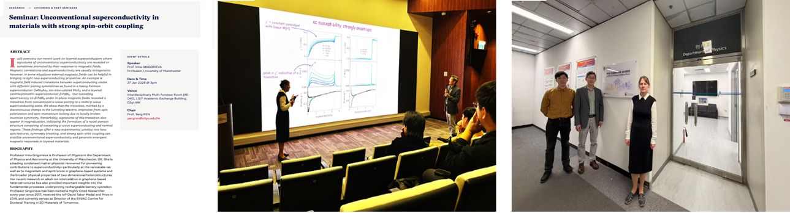

<!--more-->

Prof. Yang REN hosted Prof. Irina GRIGORIEVA, Professor of Physics at the University of Manchester, for a seminar titled 'Unconventional Superconductivity in Materials with Strong Spin-Orbit Coupling' on 27 January 2026. Prof. GRIGORIEVA introduced students and young researchers to cutting-edge topics in quantum materials, including spin-orbit coupling, unconventional superconductivity, two-dimensional materials, and emergent electronic states. Drawing on her extensive expertise and the University of Manchester's world-leading graphene and 2D materials research platform, she highlighted new pathways for exploring quantum and functional materials. Following the seminar, her visit to the JC STEM Lab stimulated in-depth discussions on future partnerships bridging Manchester's graphene strengths with the Lab's characterization capabilities.

