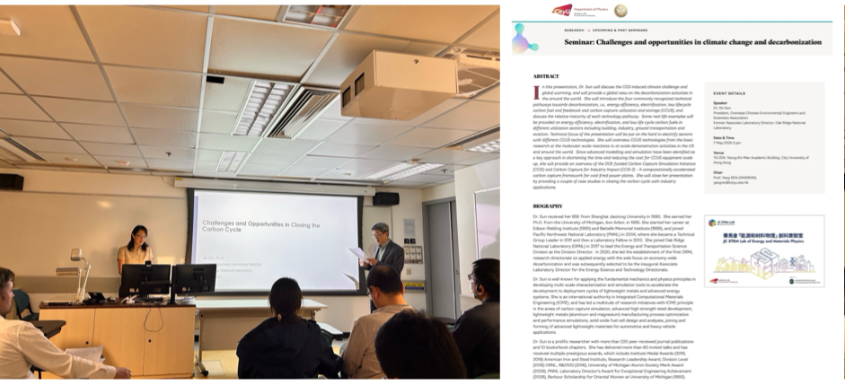

---
title: "Seminar by Dr. Xin Sun on Climate Change and Decarbonization"
date: "2025-05-07"
tags: ["seminar, invited"]
summary: "As part of efforts to foster high-level international academic exchange, Prof. Ren hosted Dr."
auto_generated: true
---

<!--more-->

As part of efforts to foster high-level international academic exchange, Prof. Ren hosted Dr. Xin Sun, President of the Overseas Chinese Environmental Engineers and Scientists Association and former Associate Laboratory Director of Oak Ridge National Laboratory (ORNL), to deliver a seminar entitled "Challenges and Opportunities in Climate Change and Decarbonization" on 7 May 2025 at City University of Hong Kong. Dr. Sun delivered a comprehensive presentation addressing the global CO鈧?induced climate challenge and outlined key decarbonization strategies, including energy efficiency, electrification, low life-cycle carbon fuels, and carbon capture, utilization, and storage (CCUS). Drawing on her leadership experience in the U.S. Department of Energy, she provided both scientific and policy-relevant insights.

