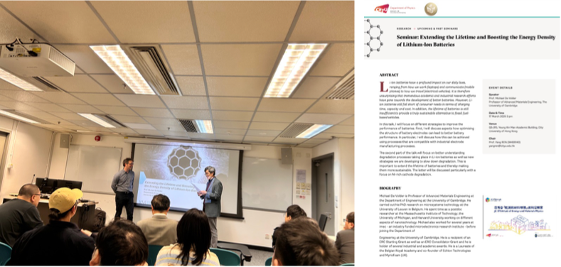

---
title: "Seminar by Prof. Michael De Volder (University of Cambridge) on Lithium-Ion Batteries"
date: "2025-03-17"
tags: ["seminar, invited"]
---

<!--more-->

On 17 March 2025, the JC STEM Lab invited Prof. Michael De Volder, Professor of Advanced Materials Engineering at the University of Cambridge, to deliver a seminar titled 'Extending the Lifetime and Boosting the Energy Density of Lithium-Ion Batteries.' Prof. De Volder shared innovative strategies for improving lithium-ion battery performance, with a focus on industrially compatible electrode structuring techniques and approaches to mitigate degradation鈥攑articularly in Ni-rich cathodes. His insights stimulated in-depth discussions with faculty and students and helped inspire new research directions related to battery sustainability and structural optimization at the JC STEM Lab.

