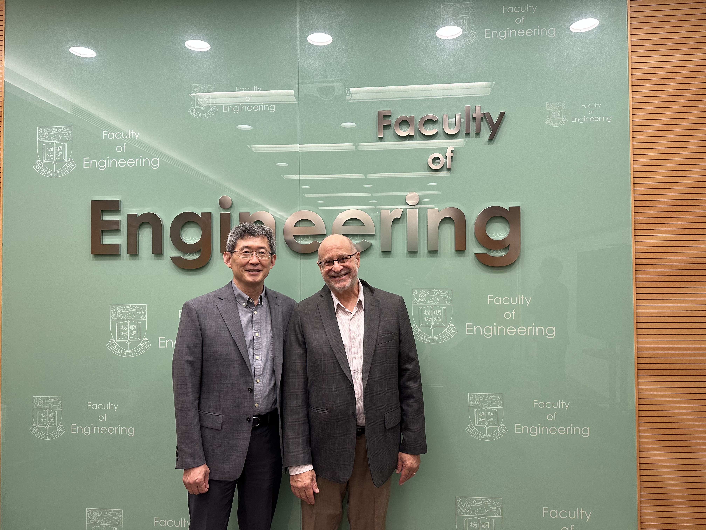

<!--more-->

Prof. Ren visited Prof. David Srolovitz at The University of Hong Kong (HKU), a globally recognized expert in computational and theoretical materials science. Their discussions centered on integrating AI-driven approaches with experimental research to better understand structure–property relationships in complex energy materials. This collaborative direction aligns with the JC STEM Lab's strategic focus on combining materials physics with data science to accelerate innovation in energy materials research.

