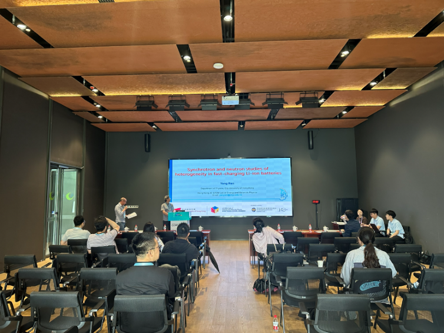

<!--more-->

Beyond hosting distinguished international scholars, Prof. Yang REN actively fosters collaborative networks with leading research institutions. On 24 June 2026, Prof. REN visited the Yangtze River Delta Physics Research Center to deliver a presentation titled 'Synchrotron Radiation and Neutron Studies on the Heterogeneity of Fast-Charging Lithium-Ion Batteries.' During the talk, he shared insights into utilizing advanced synchrotron X-ray and neutron scattering techniques to unravel the complex structural evolution, phase transitions, and microscopic heterogeneity mechanisms within battery materials during fast-charging cycles. His presentation stimulated in-depth discussions with researchers and industry experts, inspiring novel perspectives on mitigating battery degradation and enhancing performance safety.

