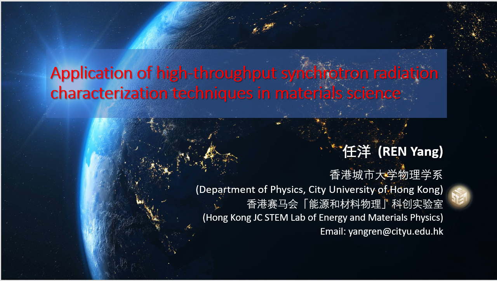

<!--more-->

The JC STEM Lab director presented an invited talk at the 2024 Joint Annual Conference of Physical Societies in Guangdong-Hong Kong-Macao Greater Bay Area, held in Macao from July 29 to August 1, 2024. This conference brought together physicists from across the Greater Bay Area to share research advances and foster collaboration. The invited talk showcased the lab's research work in energy and materials science.

