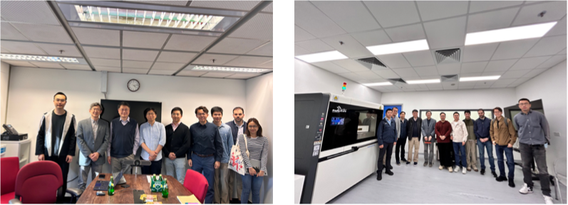

---
title: "Visit to Prof. Yeung King Lun's Group at HKUST"
date: "2024-01-01"
tags: ["visit, outbound"]
summary: "To strengthen collaboration within Hong Kong's research community, Prof. Yang Ren visited the team of Prof."
auto_generated: true
---

<!--more-->

To strengthen collaboration within Hong Kong's research community, Prof. Yang Ren visited the team of Prof. Yeung King Lun at HKUST for in-depth discussions on advanced materials, including interface engineering, catalysis, and antimicrobial technologies. The dialogue further explored how organic synthesis can be integrated with materials physics to design and prepare novel compounds for next-generation energy materials. By combining tailored molecular synthesis with in-depth physical characterization鈥攑articularly through synchrotron and neutron scattering techniques鈥攖he two groups aim to conduct application-oriented fundamental research that accelerates the transition from scientific discovery to industrial implementation. A return visit by Prof. Yeung's group to City University of Hong Kong further reinforced cross-institutional engagement.

