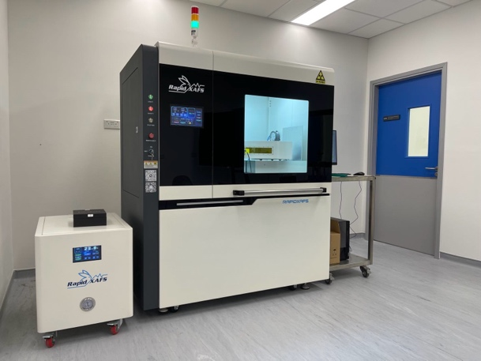
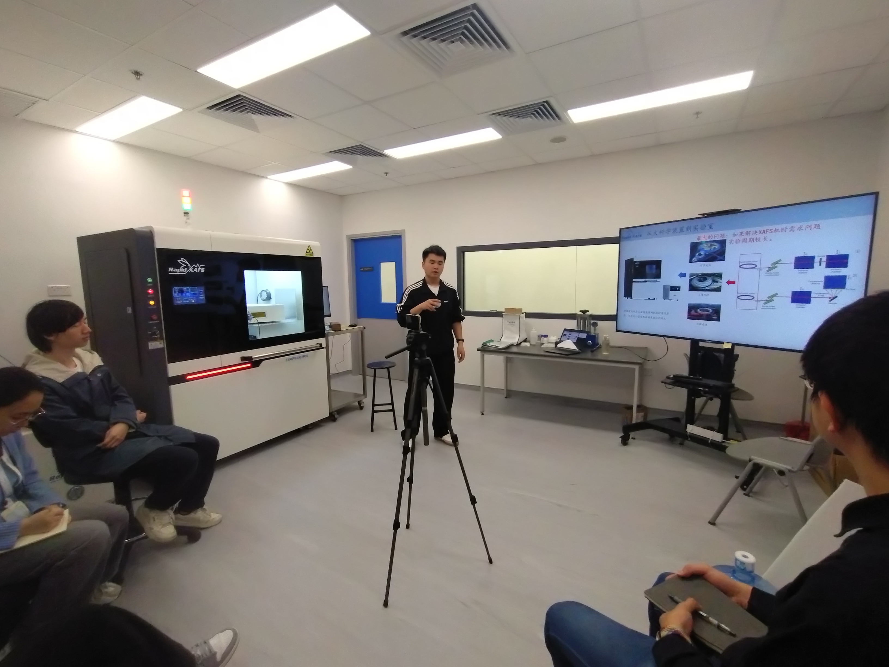

<!--more-->

The JC STEM Lab achieved a significant milestone with the installation of Hong Kong's first XAFS system (Benchtop X-ray Absorption Fine Structure Spectrometer). This cutting-edge equipment is currently in the training and calibration phase, ensuring it is fully operational to support the project's goals and enhance research capabilities. The procurement process was actively underway, aligning with the lab's scientific objectives and the need for advanced technology.

