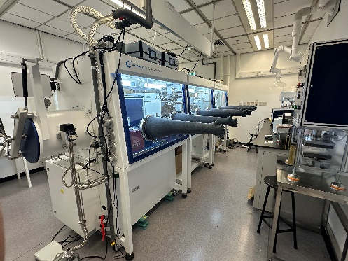
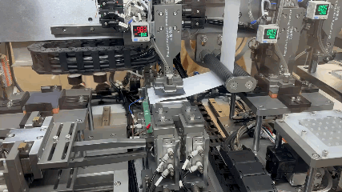

<!--more-->

During the reporting period, the Lab commissioned a pouch-cell pilot line, further broadening its research infrastructure. This is the first pouch-cell pilot line established at a Hong Kong university, complementing the laboratory's existing benchtop platforms for X-ray Absorption Spectrometer, X-ray Diffraction and integrated Laser Molecular Beam Epitaxy–Angle-resolved Photoemission Spectroscopy system. The facility allows the Laboratory to extend battery materials research from coin-cell screening to larger pouch-cell evaluation, connecting fundamental studies with practical and industrial applications. In addition, the pilot line also serves as a hands-on training platform for local STEM talent, allowing high-school and undergraduate students to gain direct experience with battery production workflows.

