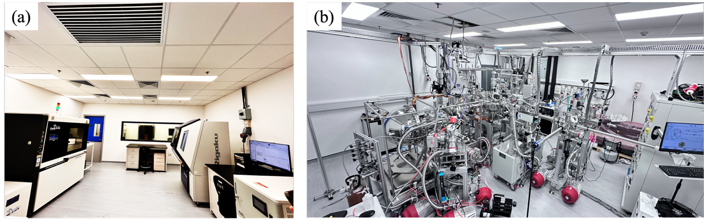

<!--more-->

During the reporting period, the JC STEM Lab of Energy and Materials Physics has successfully established a comprehensive materials preparation and characterization platform. Notably, the Lab hosts Hong Kong's first benchtop X-ray Absorption Fine Structure (XAFS) spectrometer, providing local capability for element-specific electronic and local structural analysis. This is complemented by a Rigaku SmartLab surface X-ray diffractometer, a laser-based ARPES–MBE system for surface and electronic structure studies. The Lab is further equipped with battery constant-temperature testing cabinets, inert-atmosphere gloveboxes, a conditional mixer for electrode and composite preparation, and high-temperature stages for in-situ and temperature-dependent characterization.

