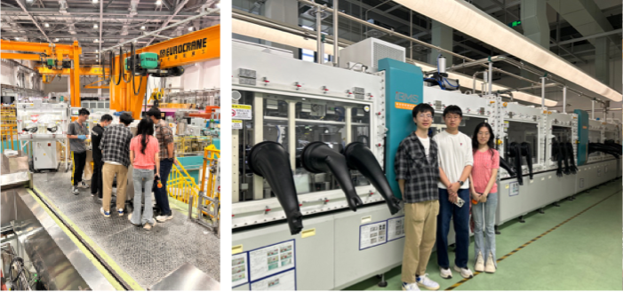

---
title: "Visiting Scholar: Mr. Zhang Jingxi from Tsinghua University"
date: "2024-11-01"
tags: ["training"]
summary: "To foster international collaboration and cultivate high-level research talent, Prof."
auto_generated: true
---

<!--more-->

To foster international collaboration and cultivate high-level research talent, Prof. Ren has consistently supported visiting scholars from leading academic and research institutions. Mr. Zhang Jingxi, a Ph.D. candidate from Tsinghua University, joined the group from November 2024 to May 2025. During this six-month research attachment, Mr. Zhang carried out in-depth investigations on Li- and Mn-rich cathode materials for advanced lithium-ion batteries. Under Prof. Ren's guidance, he acquired extensive hands-on experience with state-of-the-art synchrotron-based techniques, including X-ray absorption spectroscopy and in-situ diffraction, and actively contributed to data modeling and the preparation of high-quality manuscripts. He also collaborated with doctoral students on neutron scattering experiments and engaged in academic exchanges with industrial partners.

