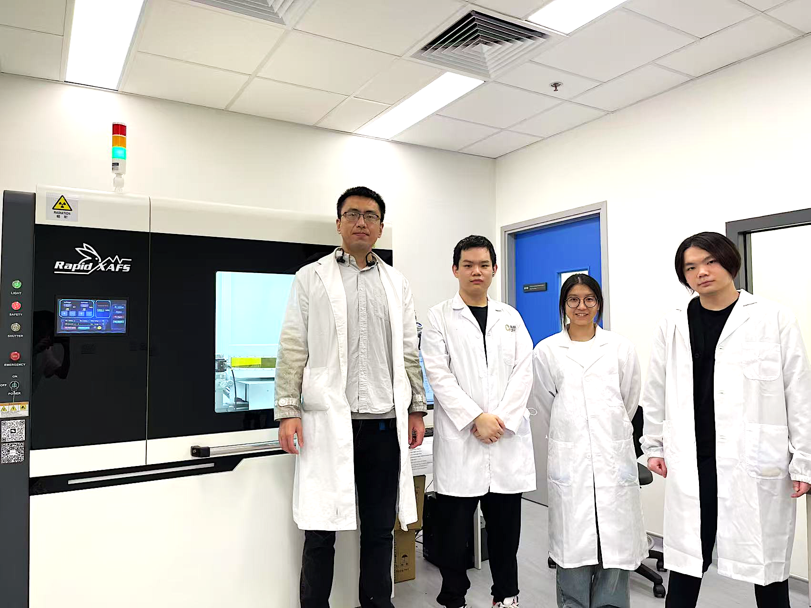

<!--more-->

Several local undergraduate and master's students are actively involved in cutting-edge materials research at the JC STEM Lab, working on cobalt-free ultrahigh-nickel layered cathode systems for lithium-ion batteries. Their research focuses on performance enhancement through strategic elemental doping: Wu Jiaqi works on aluminium and titanium doping; Xu Yishen on Zr and B elemental doping; Ye Fengting on tantalum and gallium doping; and Lam Ki Fung (local) on niobium and manganese doping. Through active mentorship and direct involvement in ongoing projects, these students are gaining hands-on experience with materials synthesis, electrochemical testing, and advanced characterization, laying a strong foundation for future academic or industry careers.

