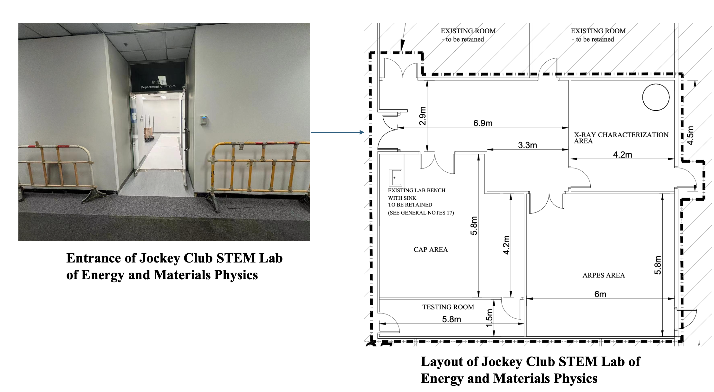
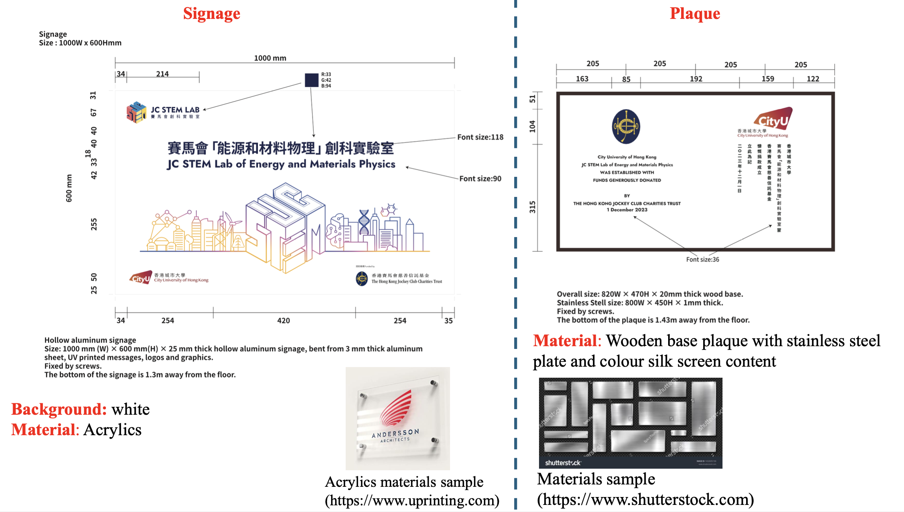

<!--more-->

Prof. Ren received HKD 9.35 million from the Hong Kong Jockey Club to establish the JC STEM Lab of Energy and Materials Physics. The University committed approximately 140 square meters for the lab space. The lab renovation started during the reporting period and was successfully completed in August 2024. The lab supports research and training activities in energy and materials physics, providing a dedicated facility for synchrotron-related research, student training, and collaboration with visiting scholars and industry partners. This significant resource commitment enhances the lab's capacity for talent development and frontier research in synchrotron X-ray techniques and materials science.

