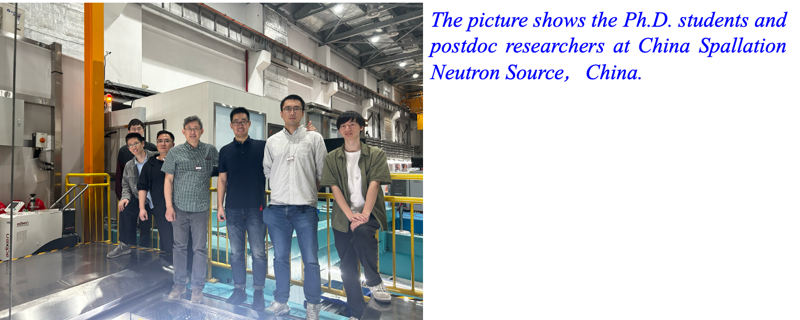

<!--more-->

Prof. Ren arranged and brought several groups of PhD students and postdocs from the Department of Physics and Department of Materials Science and Engineering at CityUHK to carry out synchrotron X-ray and neutron scattering experiments at multiple major international facilities. These included the French National Synchrotron Facility SOLEIL, the German Synchrotron Facility DESY in Hamburg, the China Spallation Neutron Source (CSNS) in Dongguan, and the Shanghai Synchrotron Radiation Facility (SSRF). The experiments supported ongoing projects in basic and applied research using advanced synchrotron techniques for materials discovery and characterization.

